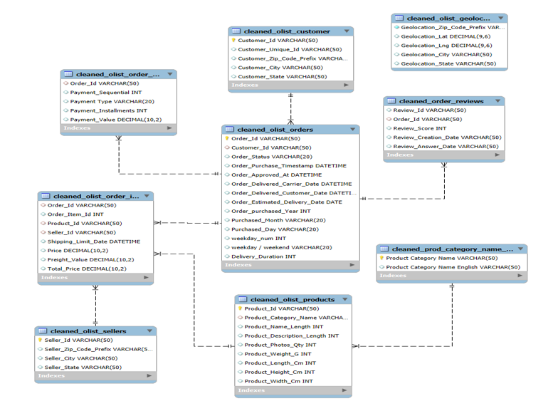
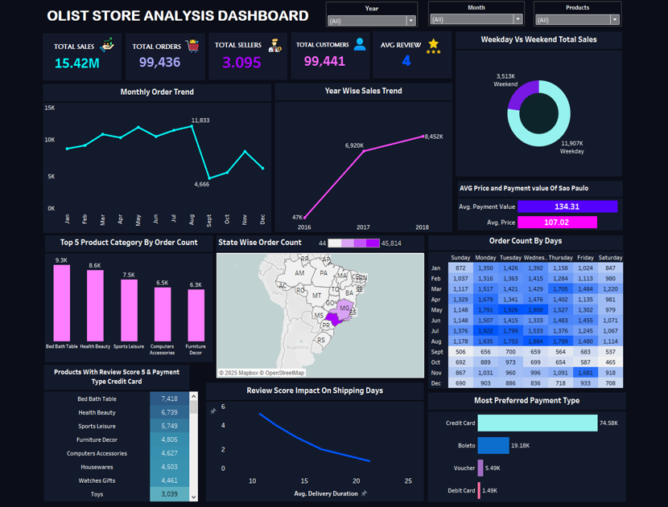

# Olist-Store-Analysis

### 🎯 Introduction
Olist is a Brazil-based e-commerce platform that connects sellers and buyers for online retail services.  
The objective of this project is to analyze **sales trends, customer behavior, and product performance** to derive insights that can help improve **customer satisfaction and overall sales performance**.

---

### ⚙ Tools Used
- Microsoft Excel  
- MySQL Workbench  
- Tableau  

---

### 📁 Dataset Overview
The dataset contained the details of Olist Store Sales from the year 2016 to 2018 with over 100k orders. The 9 tables contained the informations about Olist’s customers, customer locations, orders, products, sellers and reviews.

---

## 📌 Workflow

### Excel (Data Cleaning & Transformation)
- Standardized column names  
- Removed unwanted columns and duplicate records  
- Corrected data types  
- Performed data transformation using **Power Query Editor**  
- Created new Columns for:
  - Year  
  - Month  
  - Day  
  - Weekday / Weekend  
  - Total Price  

---

### MySQL (Data Modeling & EDA)
- Imported cleaned datasets into MySQL  
- Defined table relationships using **Primary Keys and Foreign Keys**  
- Generated an **ER Diagram**  
- Conducted **Exploratory Data Analysis (EDA)** to identify trends and patterns  

---

### 📌ER Diagram:
.

---

### Tableau (Data Visualization)
Developed an **interactive Tableau dashboard** to visualize key business metrics:

- Total Sales  
- Total Orders  
- Total Sellers  
- Total Customers  
- Average Review Score  
- Weekend vs Weekday Sales  
- Monthly Order Trend  
- Year-wise Sales  
- Top 5 Products  
- State-wise Order Count  
- Order Count by Day  
- Most Preferred Payment Type  
- Products with 5-Star Reviews using Credit Card Payments  
- Impact of Review Score on Shipping Days  

---

### Tableau Dashboard Preview:
.

---
### 🔍Key Outcomes
- Olist’s overall performance shows a significant growth in total sales, order count and customer satisfaction.
- The high review score and repeated ordering of top products like Bed Bath Table, Health Beauty, Watches Gifts shows the customer satisfaction with the product.
- Sao Paulo and Rio De Janeiro leads both in customer count and sales, highlighting its importance as a key market.
- May, consistently generate the highest sales, while September marks a decline, signaling potential seasonal variations.

### 💡 Recommendations 
- Introduce weekend specific promotions or dicsounts as weekend sales very low compared to weekdays.
- Giving a detailed information about the products can improve the customer satisfaction and order count. 
- Introducing more offers and discounts can bring more sales and orders.
- Expanding diverse payment methods can meet a strong customer satisafaction.
- Introduce more diverse products can attract more customers

